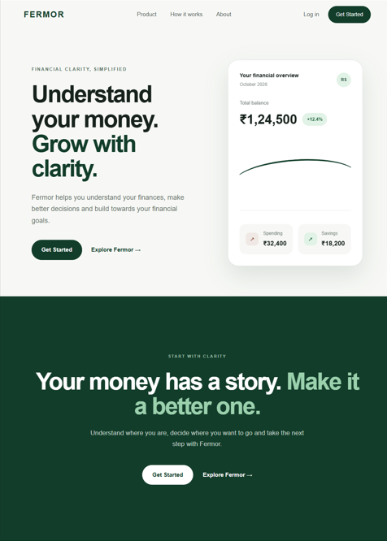
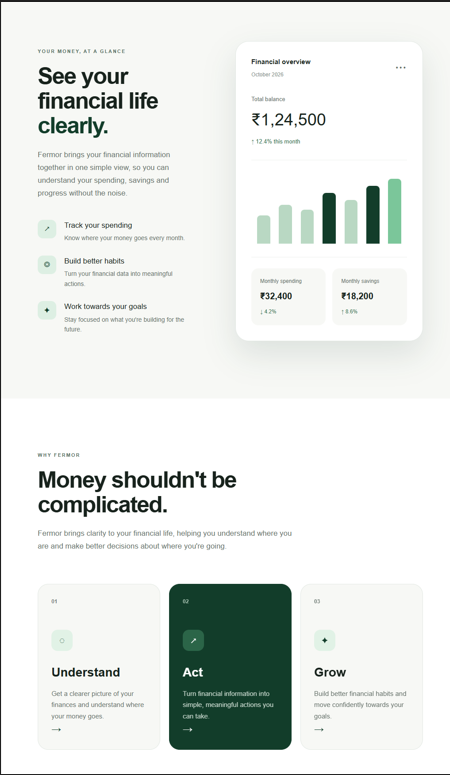
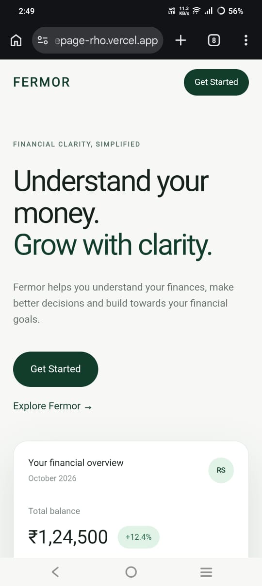

# Fermor Homepage

A modern fintech homepage designed and developed for the Fermor Frontend Developer Assignment.

## Live Website

https://fermor-homepage-rho.vercel.app

## Screenshots

### Desktop Homepage



### Product & Features



### Mobile Responsive Design



## GitHub Repository

https://github.com/rithekasenthilnathan/fermor-homepage

## Tech Stack

- Next.js
- React
- TypeScript
- CSS
- Vercel

## About the Design

The homepage is designed around the idea of making personal finance feel simple, clear and approachable.

The visual direction combines a clean fintech interface with a calm, premium aesthetic. The design uses a soft neutral background, deep green accents, rounded cards and clear typography to create a trustworthy financial experience.

## Key Sections

- Navigation
- Hero section
- Why Fermor — Understand, Act, Grow
- Financial dashboard / product showcase
- Smart Insights
- Financial Goals
- Final Call to Action
- Footer

## Product Thinking

The homepage is structured around a simple user journey:

1. Understand your financial situation
2. Take informed actions
3. Work towards financial goals

The interface prioritizes visual hierarchy, concise messaging and clear calls to action so users can understand the product quickly.

## Responsive Design

The homepage is designed to work across desktop and mobile screen sizes, with responsive layouts, spacing and typography.

## Running Locally

Clone the repository:

```bash
git clone https://github.com/rithekasenthilnathan/fermor-homepage.git